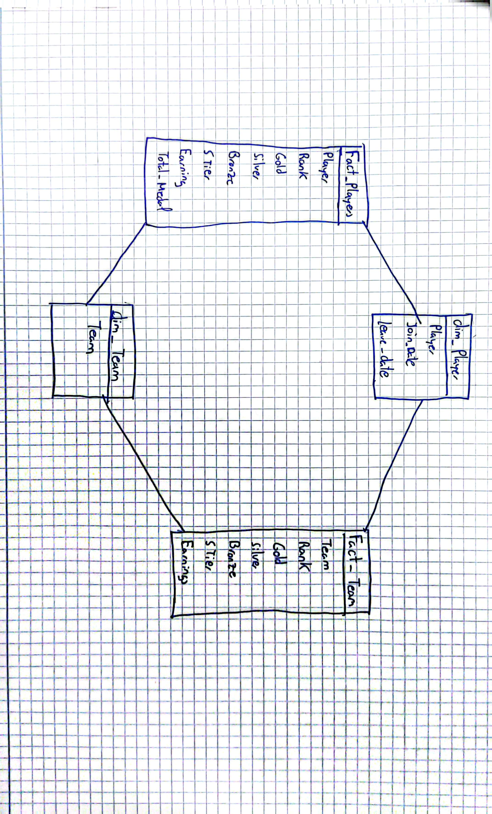
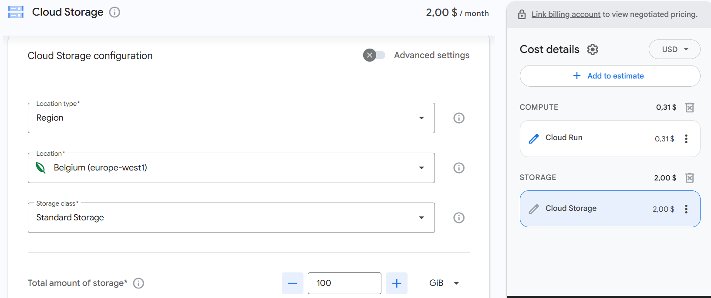

## 1. Project Overview
This project implements a complete ETL (Extract, Transform, Load) pipeline to
process Valorant esports data. I applied data engineering concepts learned during the course in a realistic scenario.

## 2. Dataset Selection & Justification
For this project, I´ve selected two datasets from Kaggle that are related:
* **Players.csv**: Detailed statistics of individual professional players.
* **Teams.csv**: Performance and earnings data of professional organizations.

**Justification:** These datasets are relatable through the competition results and rankings. By integrating them, I can analyze how individual player success correlates with overall team performance.

## 3. Data Dictionary (Raw Data)
These are the raw datasets that I chose to use for my project. Below, I describe the meaning of each column.

### Players dataset (`players.csv`)
* **Rank**: Place they rank by total earnings.
* **Player**: Professional name of the player.
* **Gold**: Events where they finished in 1st place.
* **Silver**: Events where they finished in 2nd place.
* **Bronze**: Events where they finished in 3rd place.
* **S Tier**: Events where they finished in 1st at a major (top-level) event.
* **Earnings**: Total money won in Valorant esports.

### Teams dataset (`teams.csv`)
* **Rank**: Place they rank by total earnings.
* **Team**: Name of the professional team.
* **Gold**: Events where they finished in 1st place.
* **Silver**: Events where they finished in 2nd place.
* **Bronze**: Events where they finished in 3rd place.
* **S Tier**: Events where they finished in 1st at a major (top-level) event.
* **Earnings**: Total money won in Valorant esports.

## 4. Installation
To install the necessary dependencies, run:

```bash
 pip install -r requirements.txt 
 ```

## 5. Project Workflow & Architecture
The project is organized into different steps to handle the data correctly from the start to the end.

### 5.1. Extraction (Raw Layer)
I used the `kagglehub` library to automatically download the Valorant datasets. All the original files are saved in a folder called `Raw_data`.

**Important**
Due to recent updates in the kagglehub library, automatic downloading may fail 
if you don’t have a valid Kaggle API key (kaggle.json) or if the library version 
behaves differently. 

For reproducibility, the repository includes the Raw_data folder with the required CSV files.

### 5.2. Validation 
Here, I cleaned and improved the data to make it useful.
* **Cleaning:** I removed the `$` and `,` symbols from the earnings and converted them into numbers (floats) so I could do math with them.
* **Fixing Nulls:** I simulated missing data and wrote logic to fill the gaps using backup values, ensuring the final tables are complete.
* **New Information (Feature Engineering):**
    - **Career Dates:** Since the original datasets did not include temporal information, I decided
to generate career dates to make the model more realistic. I created `Join_Date` and `Leave_Date` columns for players and teams, assigning random dates with a range that goes from 2019-2023.
    - **Medals:** I summed up the Gold, Silver, and Bronze medals to create a new `Total_Medals` column.

### 5.3. Transformation 
Here, I structured the data into fact and dimension tables.
* **Data Modeling:** I organized the data into "Fact" tables (with numbers and rankings) and "Dimension" tables (with player and team names). 

 **SCD Strategy:** The player dimension is designed to support **SCD Type 2** logic. 
  By storing `Join_Date` and `Leave_Date` in the dimension tables, the model preserves the historical context of a player's career. This ensures that any analysis of earnings or performance is tied to the specific timeframe the player was active, rather than just showing a single static snapshot.


### 5.4. Loading (Output Layer)
The final tables are saved in the `Processed_data` folder as CSV files. These files are clean and ready to be used in Looker Studio or any other tool.

## 6. Data warehouse Design
The data warehouse is designed using a **Galaxy Schema**.
It contains two fact tables (`fact_players`, `fact_teams`) that share common
dimension tables (`dim_players`, `dim_teams`).



## 7. Orchestration (Daily Execution)
The goal is to run this pipeline automatically once a day so the data is always updated.

* **Local Solution:** I use **Windows Task Scheduler**. I created a small script that opens Python and runs `main.py` every night at 3:00 AM. This way, I don’t have to run it manually.

* **Professional Setup :** If this were a real company project, I would use **GitHub Actions**. I would configure a file (YAML) with a "cron" schedule `0 3 * * *`. This tells GitHub to run my code on its servers every day at 3:00 AM, even if my computer is turned off.

## 8. Monitoring & Error Handling
To ensure my ETL pipeline works correctly every time, I implemented a monitoring system using Python's `logging` library.

* **Tracking:** The system creates a folder called `Logs` with a file `pipeline.log`. It records the exact time each step (Extract, Validation, Transform, Load) starts and finishes.
* **Error Alerts:** I used `try-except` blocks in the code. If something goes wrong (for example, if the internet fails during the download), the system writes a **CRITICAL** message in the log.
* **Data Quality:** During the transformation, the script checks for null values. If it finds unexpected missing data, it logs a warning so I can check the source files.

## 9. Scalability & Cloud Cost Analysis

In this section, I analyze the technical and financial implications of scaling my ETL pipeline by factors of x10, x100, x1000, and up to 1,000,000 rows.

### Performance Inference & Proposal
As the number of rows increases, local processing faces several bottlenecks:
* **Memory Constraints:** Pandas loads the entire dataset into RAM. At 10^6 rows, a standard laptop may experience crashes or extreme slowdowns.
* **Execution Time:** Single-threaded local processing becomes inefficient for large-scale data transformations.

### Proposed Cloud Solution
To handle very large datasets, I would migrate the pipeline to a serverless cloud setup using **Google Cloud Platform (GCP)**:

1. **Compute:** Use **Cloud Run** to execute the Python script in a containerized environment. This allows for automatic scaling and execution based on daily triggers.
2. **Storage:** Store raw and processed data in **Google Cloud Storage** as CSV or Parquet files.
3. **Data Warehouse:** For 1,000,000 rows, load the processed tables into **BigQuery** to allow fast analytical queries.

### Cloud Cost Estimation
Using the **Google Cloud Pricing Calculator**, I estimated monthly costs assuming one ETL execution per day.  
For the 1,000,000 rows scenario, the calculation is based on:
* **100 GiB:** Estimated storage for 1,000,000 rows.
* **1,000 entries per day:** Totaling **30,000 requests per month** in Cloud Run.
* **Total Cost:** $2.31 USD per month.



| Scenario | Approx. Rows | Storage Needed | Compute (Daily) | Total Monthly Cost |
| :--- | :--- | :--- | :--- | :--- |
| **Current** | ~1,000 | < 1 GB | Free  | **$0.00** |
| **x10** | 10,000 | 1 GB | Free  | **$0.01** |
| **x100** | 100,000 | 10 GB | $0.05 | **$0.25** |
| **x1000 / 10^6**| 1,000,000 | 100 GB | $0.31 | **$2.31** |

## 10. Data Delivery & Consumption
The processed data is designed to be consumed by:

* **Data Analysts:** They can use **Looker Studio** dashboards to visualize player performance and team return on investment.
* **eSports Managers:** They can scout talent by analyzing the correlation between individual medals and team earnings.
* **Solution:** For a production environment, data would be delivered via **BigQuery** (using the Cloud SDK) or a **REST API** built with FastAPI, allowing real-time access to the processed tables.

## 11. AI Usage & Privacy Concerns
* **AI Assistance:** AI could be used to assist in technical English translation, documentation structure, and optimizing the cloud cost estimation logic.Also it can help in data cleaning suggestions, data analysis ideas and code optimization tips.
* **Privacy:** The project uses 100% public eSports data. No Private Information is processed.

## 📚 References 

This project was developed using official documentation:

* **Logging System**: Implemented using the [Python Logging Cookbook](https://docs.python.org/3/howto/logging-cookbook.html#multiple-handlers) 
* **Kagglehub**: Used for dataset extraction from Kaggle. [Kagglehub GitHub Repository](https://www.kaggle.com/datasets/evangower/valorant-esports-top-earnings)
* **Google Cloud Pricing Calculator**: For estimating cloud costs. [GCP Pricing Calculator](https://cloud.google.com/products/calculator)
* **Pandas Documentation**: Used for multi-column expansion [pandas.DataFrame.apply](https://pandas.pydata.org/docs/reference/api/pandas.DataFrame.apply.html)
* **Task Scheduler**: For local orchestration on Windows. [Microsoft Docs - Task Scheduler](https://learn.microsoft.com/en-us/windows/win32/taskschd/about-the-task-scheduler)
* **GitHub Actions**: For professional orchestration. [GitHub Docs - Workflow syntax for GitHub Actions](docs.github.com/en/actions/using-workflows/workflow-syntax-for-github-actions)